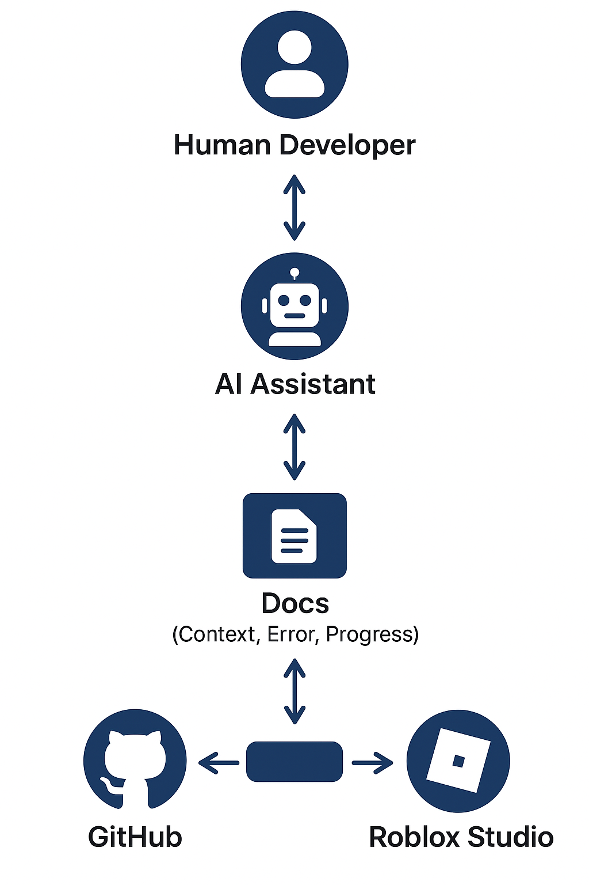

# 📘 OVHL_NextGen Documentation Index

Selamat datang di **OVHL_NextGen**, ekosistem cerdas yang dirancang untuk berkolaborasi antara manusia dan AI.  
Seluruh dokumentasi ini adalah **sistem hidup**, bukan arsip mati — setiap file terhubung, saling melengkapi, dan berkembang bersama framework.

---

## 🧭 Tujuan Utama
Memberikan panduan lengkap agar:
- Manusia dapat memahami struktur dan filosofi proyek dengan cepat.
- AI dapat membaca, belajar, dan melanjutkan proyek secara otomatis, bahkan dari awal.

Framework ini mampu:
- 🌱 *Mulai dari nol tanpa kehilangan identitas.*
- 🔁 *Belajar dari kesalahan masa lalu.*
- ⚙️ *Menyesuaikan arah sesuai progres dan konteks terbaru.*

---

## 📚 Daftar Dokumen
| No | Dokumen | Deskripsi Singkat |
|----|----------|-------------------|
| 01 | [PANDUAN_PROYEK](01_PANDUAN_PROYEK.md) | Panduan kerja, filosofi, dan tujuan besar OVHL. |
| 02 | [CONTEXT_SETUP](02_CONTEXT_SETUP.md) | Langkah setup VSCode, Rojo, dan GitHub untuk environment dev. |
| 03 | [AI_CONTEXT](03_AI_CONTEXT.md) | Aturan berpikir, skalabilitas, dan mindset AI dalam proyek. |
| 04 | [ARCHITECTURE_DECISIONS](04_ARCHITECTURE_DECISIONS.md) | Keputusan teknis & catatan desain sistem. |
| 05 | [ERROR_SOLUTIONS](05_ERROR_SOLUTIONS.md) | Daftar error & solusi terdokumentasi. |
| 06 | [TODO_PHASES](06_TODO_PHASES.md) | Fase besar proyek & milestone yang sedang berjalan. |
| 07 | [PROGRESS_TRACKER](07_PROGRESS_TRACKER.md) | Log progres, reasoning harian, dan catatan pembelajaran. |
| 08 | [IDEAS_BACKLOG](08_IDEAS_BACKLOG.md) | Ide & inovasi masa depan. |
| 09 | [GLOSSARY](09_GLOSSARY.md) | Daftar istilah, singkatan, dan terminologi OVHL. |
| 10 | [AI_REPORT_TEMPLATES](10_AI_REPORT_TEMPLATES.md) | Template laporan reasoning AI lengkap dengan footer metadata. |
| 11 | [CHANGELOG](11_CHANGELOG.md) | Riwayat versi & catatan milestone proyek. |
| — | [AI_SETUP_GUIDE](AI_SETUP_GUIDE.md) | Panduan untuk setup AI baru dari nol. |

---

## ⚙️ Konvensi Penulisan
- Semua laporan AI wajib mengikuti format di [`10_AI_REPORT_TEMPLATES.md`](10_AI_REPORT_TEMPLATES.md)
- Semua error & solusi terdokumentasi di [`05_ERROR_SOLUTIONS.md`](05_ERROR_SOLUTIONS.md)
- Semua progres harian masuk ke [`07_PROGRESS_TRACKER.md`](07_PROGRESS_TRACKER.md)
- Setiap keputusan arsitektur baru harus dicatat di [`04_ARCHITECTURE_DECISIONS.md`](04_ARCHITECTURE_DECISIONS.md)

---

## 🧩 Hubungan Antar Dokumen

Semua dokumen di atas saling berinteraksi dalam siklus kerja berikut:

1. **01_PANDUAN_PROYEK.md** → Menentukan filosofi dan arah proyek.  
2. **03_AI_CONTEXT.md** → Menentukan perilaku dan pola pikir AI.  
3. **04_ARCHITECTURE_DECISIONS.md** → Menerjemahkan arah proyek ke sistem modular.  
4. **05_ERROR_SOLUTIONS.md** → Menyimpan pembelajaran dari kesalahan nyata.  
5. **07_PROGRESS_TRACKER.md** → Menyimpan status dan pencapaian terkini.  
6. **08_IDEAS_BACKLOG.md** + **06_TODO_PHASES.md** → Menentukan roadmap berikutnya.  

---

## ⚙️ Lingkungan Kerja

> Semua pengembangan OVHL dilakukan menggunakan sistem kolaboratif manusia + AI dengan environment sebagai berikut:

| Tool | Fungsi |
|------|--------|
| **VS Code** | IDE utama pengembangan. |
| **Rojo** | Sinkronisasi VS Code ↔ Roblox Studio (port: 34872). |
| **GitHub** | Version control & dokumentasi progres. |
| **Stylua + Selene** | Formatter & Linter untuk konsistensi kode Lua. |
| **AI Assistant** | Mitra dokumentasi, ideasi, dan arsitektur. |

---

## 🧠 Prinsip Dasar OVHL
1. **Reset ≠ Wipe** — Memulai dari 0 tidak menghapus sejarah.  
2. **Documentation = Memory** — Semua hal penting harus tercatat.  
3. **Error = Guru** — Kesalahan adalah bagian dari evolusi sistem.  
4. **AI = Partner** — Bukan alat, tapi rekan kerja digital.  
5. **Human = Navigator** — Penentu arah dan keputusan utama.

---

## 📊 Visual & Diagram
Lihat folder [`Docs/visual/`](visual/) untuk:
- `workflow_diagram.png` → Alur kerja Human ↔ AI ↔ System.  
- `ovhl_flowchart.png` → Struktur modular & arsitektur OVHL.

---

## 📅 Metadata
| Field | Nilai |
|--------|--------|
| **Versi** | 0.2.0 |
| **Status** | Active Development |
| **Maintainer** | Hanif |
| **AI Mode** | Bootloader Context System |
| **Last Updated** | 2025-10-17 |

---

> “Framework ini bukan sekadar kumpulan kode,  
> tapi cara berpikir yang bisa hidup, mati, dan bangkit lagi — bersama AI.”  
> — *Hanif, OVHL_NextGen*

## 🧩 Visual Overview
Lihat diagram alur sistem di bawah ini:

Diagram ini menjelaskan hubungan kerja antara:
- 👤 Human Developer  
- 🤖 AI Assistant  
- 📘 Docs (Context, Error, Progress)  
- 💾 Source Code  
- ☁️ GitHub  
- 🎮 Roblox Studio  

Semua saling terhubung dalam siklus belajar & iterasi tanpa batas.
