# 🔄 OVHL MODULE COMMUNICATION FLOWCHART

## 🏗️ ARCHITECTURE OVERVIEW

```
[OVHL CORE] <---> [OVHL UI] <---> [OTHER MODULES]
       ↑             ↑             ↑
       └───────────[OVHL SHARED]────────┘
```

## 🔄 DETAILED COMMUNICATION FLOW

### 1. BOOT SEQUENCE

```mermaid
graph TB
A[🎯 Creator Drag Module] --> B[🔄 Bootloader Detect]
B --> C[⚙️ Kernel Initialize]
C --> D[📦 Install Module]
D --> E[🖥️ UI Show Visual Guide]
E --> F[✅ System Ready]
C --> G[🔧 Setup Shared Events]
G --> H[📡 Register Module APIs]
```



### 2. RUNTIME COMMUNICATION

```mermaid
graph LR
subgraph "OVHL CORE"
A[⚙️ Kernel]
B[🔄 Bootloader]
C[📡 Event Bus]
end

subgraph "OVHL UI"
D[🖥️ Visual Guide]
E[🎨 Interface Manager]
F[📱 Input Handler]
end

subgraph "OTHER MODULES"
G[🔦 Lighting Module]
H[🎵 Sound Module]
I[🤖 AI Module]
end

A <--> C
B <--> C
D <--> C
E <--> C
F <--> C
G <--> C
H <--> C
I <--> C
D --> E
E --> F
```



### 3. DATA FLOW EXAMPLE: LIGHTING MODULE


---

## 📡 COMMUNICATION PROTOCOLS

### 1. CORE → UI MESSAGES
```lua
-- Core memerintahkan UI untuk menampilkan sesuatu
OVHL_Shared.Events.CoreToUI:Fire({
    type = "show_visual_guide",
    module = "AdvancedLighting",
    step = "installation_complete",
    data = {lights_created = 5}
})
```

### 2. UI → CORE MESSAGES
```lua
-- UI melaporkan user action ke Core
OVHL_Shared.Events.UIToCore:Fire({
    type = "user_action",
    module = "AdvancedLighting",
    action = "create_light",
    parameters = {position = Vector3.new(10, 5, 10), intensity = 2.0}
})
```

### 3. MODULE → CORE MESSAGES
```lua
-- Module melaporkan status ke Core
OVHL_Shared.Events.ModuleToCore:Fire({
    module = "AdvancedLighting",
    event = "light_created",
    data = {light_id = "light_123", owner = player}
})
```

### 4. CORE → MODULE MESSAGES
```lua
-- Core memberikan perintah ke Module
OVHL_Shared.Events.CoreToModule:Fire({
    target_module = "AdvancedLighting",
    command = "cleanup_lights",
    parameters = {player = target_player}
})
```

---

## 🏗️ IMPLEMENTATION STRUCTURE

```
OVHL_Shared/
└── Communication/
    ├── EventBus.server.lua
    ├── EventBus.client.lua
    ├── MessageProtocol.lua
    └── APIRegistry.lua
```

### EventBus Implementation (`OVHL_Shared/Communication/EventBus.server.lua`)

```lua
local EventBus = {}
EventBus.__index = EventBus

function EventBus.new()
    local self = setmetatable({}, EventBus)
    -- Create communication events (using RemoteEvent analogy for cross-script/context comm)
    self.CoreToUI = Instance.new("RemoteEvent")
    self.CoreToUI.Name = "OVHL_CoreToUI"
    self.CoreToUI.Parent = game:GetService("ReplicatedStorage")

    self.UIToCore = Instance.new("RemoteEvent")
    self.UIToCore.Name = "OVHL_UIToCore"
    self.UIToCore.Parent = game:GetService("ReplicatedStorage")

    self.ModuleToCore = Instance.new("RemoteEvent")
    self.ModuleToCore.Name = "OVHL_ModuleToCore"
    self.ModuleToCore.Parent = game:GetService("ReplicatedStorage")

    self.CoreToModule = Instance.new("RemoteEvent")
    self.CoreToModule.Name = "OVHL_CoreToModule"
    self.CoreToModule.Parent = game:GetService("ReplicatedStorage")

    return self
end

-- Core mengirim pesan ke UI
function EventBus:CoreToUIMessage(module, message_type, data)
    self.CoreToUI:FireAllClients({
        module = module,
        type = message_type,
        data = data,
        timestamp = os.time()
    })
end

-- UI mengirim pesan ke Core
function EventBus:UIToCoreMessage(player, module, action, parameters)
    self.UIToCore:FireServer({
        player = player,
        module = module,
        action = action,
        parameters = parameters,
        timestamp = os.time()
    })
end

-- Module melaporkan ke Core
function EventBus:ModuleToCoreMessage(module, event, data)
    self.ModuleToCore:FireServer({
        module = module,
        event = event,
        data = data,
        timestamp = os.time()
    })
end

-- Core memberikan perintah ke Module
function EventBus:CoreToModuleMessage(target_module, command, parameters)
    self.CoreToModule:FireAllClients({
        target_module = target_module,
        command = command,
        parameters = parameters,
        timestamp = os.time()
    })
end

return EventBus
```

---

## 🎯 USAGE EXAMPLES

### 1. Lighting Module Initialize
```lua
-- Di AdvancedLighting/Main.server.lua
function AdvancedLighting:initialize()
    -- Register module ke Core
    OVHL_Shared.EventBus:ModuleToCoreMessage(
        "AdvancedLighting",
        "module_initialized",
        {version = "1.0.0", lights_count = 0}
    )

    -- Minta UI tampilkan visual guide
    OVHL_Shared.EventBus:CoreToUIMessage(
        "AdvancedLighting",
        "show_tutorial",
        {step = "welcome", duration = 10}
    )
end
```

### 2. UI Handle User Input
```lua
-- Di OVHL_UI/Main.client.lua
function handle_light_creation_click()
    OVHL_Shared.EventBus:UIToCoreMessage(
        game:GetService("Players").LocalPlayer,
        "AdvancedLighting",
        "create_light",
        {position = get_mouse_position(), intensity = 2.0}
    )
end
```

### 3. Core Manage Modules
```lua
-- Di OVHL_Core/Kernel.server.lua
function Kernel:handle_module_request(data)
    if data.action == "create_light" then
        local module = self:get_module("AdvancedLighting")
        if module then
            module:create_light(data.player, data.parameters.position, data.parameters.intensity)
        end
    end
end
```

---

## 🔒 ERROR HANDLING & VALIDATION

```lua
function EventBus:validate_message(message)
    -- Validasi structure message
    if not message.module or not message.type then
        return false, "Invalid message structure"
    end

    -- Validasi module exists (Asumsi OVHL_Core bisa diakses)
    -- if not OVHL_Core:module_exists(message.module) then
    --     return false, "Module not found: " .. message.module
    -- end

    -- Rate limiting (Placeholder)
    -- if not self:check_rate_limit(message) then
    --     return false, "Rate limit exceeded"
    -- end

    return true, "Valid"
end
```

---

## ✅ FLOWCHART INI MEMASTIKAN:
* **Komunikasi terstruktur** antar semua module
* **Error handling** yang robust
* **Scalability** untuk module tambahan
* **Maintainability** yang mudah
* 
